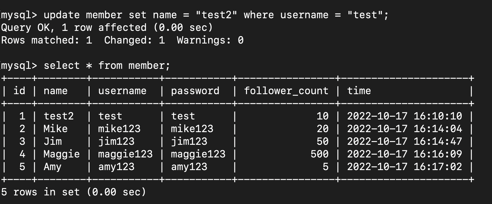

# 要求三

* 新增⼀筆資料到 member 資料表中，這筆資料的 username 和password 欄位必須是 test。接著繼續新增⾄少 4 筆隨意的資料。

   ```sql
        insert into member
            (name, username, password, follower_count) 
            value("John", "test", "test", 10);
  
        insert into member
            (name, username, password, follower_count)
            value("Mike", "mike123", "mike123", 20);

        insert into member
            (name, username, password, follower_count)
            value("Jim", "jim123", "jim123", 50);

        insert into member
            (name, username, password, follower_count)
            value("Maggie", "maggie123", "maggie123", 500);

        insert into member
            (name, username, password, follower_count)
            value("Amy", "amy123", "amy123", 5);
    ```

----

* 取得所有在 member 資料表中的會員資料

  ``` sql
  select * from member
  ```


----

* 取得所有在 member 資料表中的會員資料，並按照 time 欄位，由
近到遠排序。

    ``` sql
        select * from member order by time desc;
    ```

    

----

* 取得 member 資料表中第 2 ~ 4 共三筆資料，並按照 time 欄位，由近到遠排序。

    ```sql
        select * from member order by time desc limit 1, 3;
    ```

    

----

* 取得欄位 username 是 test 的會員資料。
  
    ```sql
        select * from member where username="test";
    ```

    

----

  
* 使⽤ SELECT 指令取得欄位 username 是 test、且欄位 password 也是 test 的資料。
  
    
    ```sql
        select * from member 
            where username="test" and password="test";
    ```
    

----

* 更新欄位 username 是 test 的會員資料，將資料中的 name 欄位改成 test2。

    ```sql
        set sql_safe_updates=0;

        update member set name = "test2" 
            where username = "test";
    ```
    

----

# 要求四

* 取得 member 資料表中，總共有幾筆資料。

    ```sql
        select count(*) from member;
    ```
    

----

* 取得 member 資料表中，所有會員 follower_count 欄位的總和。

    ```sql
        select sum(follower_count) from member;
    ```
    
    

----

* 取得 member 資料表中，所有會員 follower_count 欄位的平均數。

    ```sql
        select avg(follower_count) from member;
    ```

    

----

# 要求五

* 在資料庫中，建立新資料表紀錄留⾔資訊，取名字為 message 。資料表中必須包含以下欄位設定：

    ```sql
        create table message(
            id bigint primary key auto_increment,
            member_id bigint not null,
            content varchar(255) not null,
            like_count int unsigned not null default 0,
            time datetime NOT NULL DEFAULT CURRENT_TIMESTAMP
        );
    ```

    

----

* member中多增加幾個 username 為 test 的使用者

    ```sql
        insert into member 
            (name, username, password, follower_count) 
            values ("Jush", "test", "test", 30);

        insert into member 
            (name, username, password, follower_count) 
            values ("Amber", "test", "test", 70);

        insert into member 
            (name, username, password, follower_count) 
            values ("Patty", "test", "test", 2);
    ```
    

----

* 新增message;

    ```sql
        nsert into message 
            (member_id, content, like_count) 
            values(1, "安安", 15);

        insert into message 
            (member_id, content, like_count) 
            values(2, "你好", 3);

        insert into message 
            (member_id, content, like_count) 
            values(3, "哈哈", 50);

        insert into message 
            (member_id, content, like_count) 
            values(4, "讚", 20);

        insert into message 
            (member_id, content, like_count) 
            values(5, "讚讚", 10);

        insert into message 
            (member_id, content, like_count) 
            values(6, "呵呵", 10);

        insert into message 
            (member_id, content, like_count) 
            values(7, "嘻嘻", 90);

        insert into message 
            (member_id, content, like_count) 
            values(8, "UU", 40);
    ```
    

* 取得所有留⾔，結果須包含留⾔者會員的姓名。

    ```sql
        select member.name, 
            message.content, 
            like_count 
            from member inner join message on 
                member.id = message.member_id;
    ```
    

----

* foreign key 建立關聯性

    ```sql
        alter table message 
        add foreign key
        (member_id) references 
        member(id);
    ```

----

* 使⽤ SELECT 搭配 JOIN 語法，取得 member 資料表中欄位 username 是 test 的所有留⾔，資料中須包含留⾔者會員的姓名。

    ```sql
        select member.name, 
            member.username, 
            message.content, 
            like_count 
            from member inner join message on 
            member.username = "test"
            and member.id = message.member_id;
    ```
    

----

* 將username 建立index

    ```sql
        alter table member 
        add index username_index(username);
    ```

----

* 取得 member 資料表中欄位 username 是 test 的所有留⾔平均按讚數

    ```sql
        select avg(like_count) 
            from message inner join member on member.username = "test" and
            member.id = message.member_id;
    ```
    
